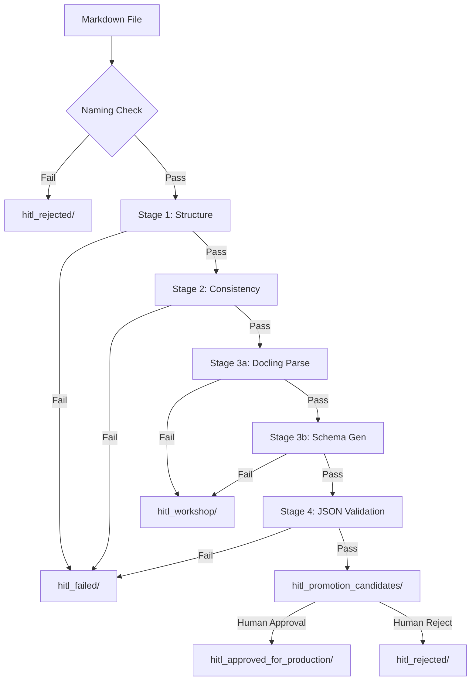

# HITL Development Pipeline - Complete Documentation

## Executive Summary

The Human-in-the-Loop (HITL) development pipeline is a critical 4-stage validation system that implements **markdown-as-source-code** philosophy for DUX schema governance. This documentation identifies current gaps, risks, and provides comprehensive workflow guidance.

## 🚨 Critical Gaps & Risks Identified

### Testing Gaps

1. **No BDD Test Coverage for HITL Pipeline**
   - **Risk**: Pipeline changes could break validation flow without detection
   - **Impact**: Inconsistent object validation, failed deployments
   - **Recommendation**: Implement `features/hitl_pipeline_validation.feature` immediately

2. **Missing Stage 2 Implementation**
   - **Risk**: Content consistency validation is referenced but script doesn't exist
   - **Impact**: Objects with inconsistent content pass to Stage 3
   - **Status**: Currently integrated into other stages (unclear where)

3. **Missing Stage 3b Script**
   - **Risk**: Schema generation validation step lacks implementation
   - **Impact**: Invalid schemas could be generated from valid markdown

4. **No Integration Tests**
   - **Risk**: Individual stages may work but fail when integrated
   - **Impact**: Queue management and file routing failures

5. **No Prompt Validation Pipeline**
   - **Risk**: Agent prompts may contain invalid example JSON
   - **Impact**: LLM extraction produces invalid objects

### Output Consistency Risks

1. **Docling Host Machine Dependency**
   - **Risk**: Stage 3a requires docling on host machine (not in container)
   - **Impact**: Pipeline fails in containerized environments
   - **Mitigation**: Document requirement, add fallback handling

2. **Partial Object Type Coverage**
   - **Risk**: Only Problem, Behavior, Result have Stage 3 scripts
   - **Impact**: Other object types (Flow, Insight, etc.) can't be processed

3. **Manual Queue Management**
   - **Risk**: Auto-pull logic exists but no monitoring
   - **Impact**: Queue backlogs, processing delays

4. **No Rollback Mechanism**
   - **Risk**: Bad objects promoted to production
   - **Impact**: System-wide schema corruption

## Complete Workflow Documentation

### Overview

The HITL pipeline ensures schema quality through progressive validation stages with human oversight at critical points.



### Detailed Stage Specifications

#### Pre-Stage: Naming Convention Check
- **Purpose**: Enforce consistent file naming
- **Pattern**: `{object_type}_*_*_object_model_definition.md`
- **Implementation**: ✅ Exists in `hitl_orchestrator.py`
- **Test Coverage**: ❌ No BDD tests

#### Stage 1: Structure & Template Validation
- **Script**: `scripts/validation/hitl_pipeline/stage1_structure_validation.py`
- **Purpose**: Validate markdown follows DUX template
- **Checks**:
  - Required sections present
  - Schema Attributes table exists
  - Canonical Example JSON block present
  - Object type matches filename
- **Implementation**: ✅ Exists
- **Test Coverage**: ❌ No BDD tests

#### Stage 2: Consistency Validation
- **Script**: ❌ **MISSING** - Referenced but not found
- **Purpose**: Validate content consistency
- **Planned Checks**:
  - Field descriptions match types
  - Cross-references valid
  - Evidence arrays structured correctly
- **Implementation**: ❌ Missing
- **Test Coverage**: ❌ No tests

#### Stage 3a: Docling Processing
- **Scripts**: 
  - `stage3a_problem_docling_md.py` ✅
  - `stage3a_behavior_basic_docling.py` ✅
  - `stage3a_result_basic_docling.py` ✅
  - Others: ❌ **MISSING**
- **Purpose**: Parse markdown to Docling structure
- **Process**:
  - Extract Schema Attributes table
  - Parse using `table.data.grid` method
  - Generate structured document
- **Implementation**: ⚠️ Partial (3 of 7 object types)
- **Test Coverage**: ❌ No BDD tests
- **Critical Issue**: Requires host machine docling installation

#### Stage 3b: Schema Generation & Validation
- **Scripts**: 
  - `stage3b_problem_schema_validation.py` ✅
  - `stage3b_behavior_schema_validation.py` ✅
  - `stage3b_result_schema_validation.py` ✅
  - Others: ❌ **MISSING**
- **Purpose**: Generate and validate JSON schemas
- **Implementation**: ⚠️ Partial (3 of 7 object types)
- **Test Coverage**: ❌ No BDD tests

#### Stage 4: JSON Schema Validation
- **Script**: `scripts/validation/validate_dux_objects.py`
- **Purpose**: Final validation against v9.6 schemas
- **Features**:
  - Queue management
  - Auto-pull next object
  - Error logging
- **Implementation**: ✅ Exists
- **Test Coverage**: ❌ No integration tests

### Queue Management System

```
watch_folders/
├── hitl_review/                    # ONE object at a time
├── hitl_review_queue/              # Type-specific queues
│   ├── problem_objects/            # FIFO processing
│   ├── behavior_objects/           
│   ├── result_objects/             
│   └── other_objects/              
├── hitl_workshop/                  # Stage 3 failures
├── hitl_failed/                    # Stage 1,2,4 failures
├── hitl_promotion_candidates/      # Awaiting human approval
├── hitl_approved_for_production/   # Production ready
└── hitl_rejected/                  # Human rejected
```

### Critical Control Points

1. **Entry**: One object per type in `hitl_review/`
2. **Stage Transitions**: Automated based on validation results
3. **Human Approval**: Required for production deployment
4. **Queue Auto-Pull**: After any completion (pass/fail)

## Implementation Priorities

### Immediate (P0)
1. Create Stage 2 consistency validation script
2. Document docling host requirement in all Stage 3a scripts
3. Create BDD test for basic HITL flow

### Short-term (P1)
1. Implement remaining Stage 3a/3b scripts for all object types
2. Create integration test suite
3. Add queue monitoring and metrics

### Medium-term (P2)
1. Implement prompt validation pipeline
2. Add rollback mechanism
3. Create automated recovery procedures

## Monitoring & Success Metrics

### Key Performance Indicators
- **Queue Depth**: Objects waiting per type
- **Stage Failure Rates**: Identify validation bottlenecks
- **Time to Production**: Markdown submission to approval
- **Rollback Frequency**: Production issues requiring reversion

### Health Checks
```python
# Queue health check
def check_queue_health():
    metrics = {}
    for queue_type in ['problem', 'behavior', 'result', 'other']:
        queue_dir = Path(f"hitl_review_queue/{queue_type}_objects")
        metrics[queue_type] = len(list(queue_dir.glob("*.md")))
    return metrics

# Stage success rates
def calculate_stage_success():
    # Track files moving through each stage
    # Calculate pass/fail percentages
    pass
```

## Risk Mitigation Strategies

### For Testing Gaps
1. **Immediate**: Create minimal BDD test for happy path
2. **Progressive**: Add edge cases and error scenarios
3. **Continuous**: Run tests on every commit

### For Output Consistency
1. **Standardize**: Create templates for all object types
2. **Validate**: Add pre-flight checks before Stage 1
3. **Monitor**: Track validation failure patterns

### For Missing Components
1. **Prioritize**: Focus on most-used object types first
2. **Document**: Clear specs before implementation
3. **Test**: BDD-first development approach

## Emergency Procedures

### Pipeline Failure Recovery
```bash
# 1. Check current state
ls -la watch_folders/hitl_review/
ls -la watch_folders/hitl_failed/

# 2. Review error logs
cat watch_folders/hitl_failed/*_errors.txt

# 3. Manual queue management if needed
mv watch_folders/hitl_review_queue/problem_objects/oldest_file.md \
   watch_folders/hitl_review/

# 4. Restart orchestrator
python scripts/validation/hitl_pipeline/hitl_orchestrator.py
```

### Rollback Procedure
```bash
# 1. Identify problematic object
grep -r "problem_identifier" watch_folders/

# 2. Move from production to rejected
mv watch_folders/hitl_approved_for_production/problem_object.md \
   watch_folders/hitl_rejected/

# 3. Document reason
echo "Rollback reason: [description]" > \
   watch_folders/hitl_rejected/problem_object_rejection.txt

# 4. Restore previous version from git
git checkout HEAD~1 src/dux_v9.6_split_schema/problem_object.json
```

## Appendix: Missing Test Scenarios

### Required BDD Features

1. **hitl_pipeline_validation.feature**
```gherkin
Feature: HITL Pipeline Validation
  As a schema developer
  I want the HITL pipeline to validate my markdown objects
  So that only valid schemas reach production

  Scenario: Valid object passes all stages
    Given a valid Problem object markdown file
    When I submit it to the HITL pipeline
    Then it should pass Stage 1 structure validation
    And it should pass Stage 2 consistency validation
    And it should pass Stage 3a docling processing
    And it should pass Stage 3b schema generation
    And it should pass Stage 4 JSON validation
    And it should be moved to promotion candidates

  Scenario: Invalid structure fails at Stage 1
    Given a Problem object missing Schema Attributes table
    When I submit it to the HITL pipeline
    Then it should fail Stage 1 validation
    And it should be moved to hitl_failed
    And an error log should be created

  Scenario: Queue management processes objects in order
    Given multiple objects in the review queue
    When an object completes processing
    Then the oldest queued object should be pulled
    And it should maintain FIFO ordering
```

2. **prompt_validation.feature**
3. **schema_propagation.feature**
4. **rollback_procedures.feature**

## Next Steps

1. **Implement Stage 2 Script** (Critical)
2. **Create BDD Test Suite** (Critical)
3. **Document Docling Requirements** (High)
4. **Complete Object Type Coverage** (High)
5. **Add Monitoring Dashboard** (Medium)

---

**Last Updated**: 2025-07-12
**Status**: GAPS IDENTIFIED - ACTION REQUIRED